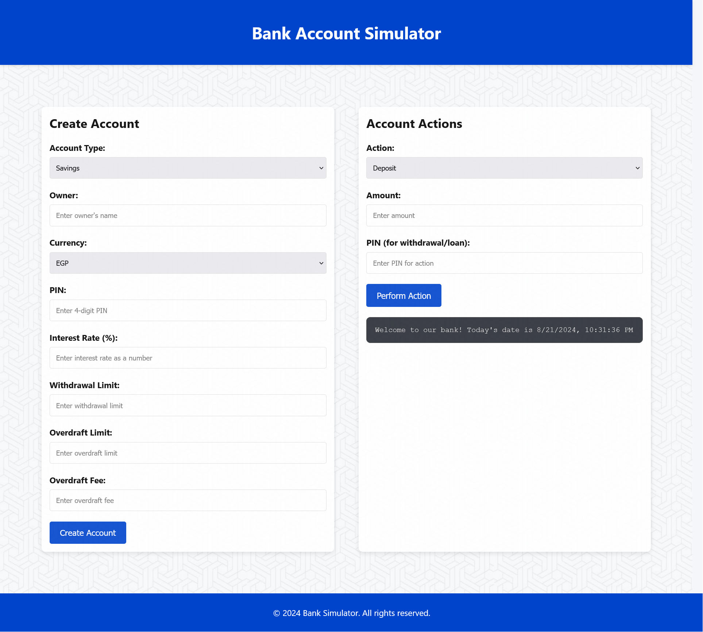
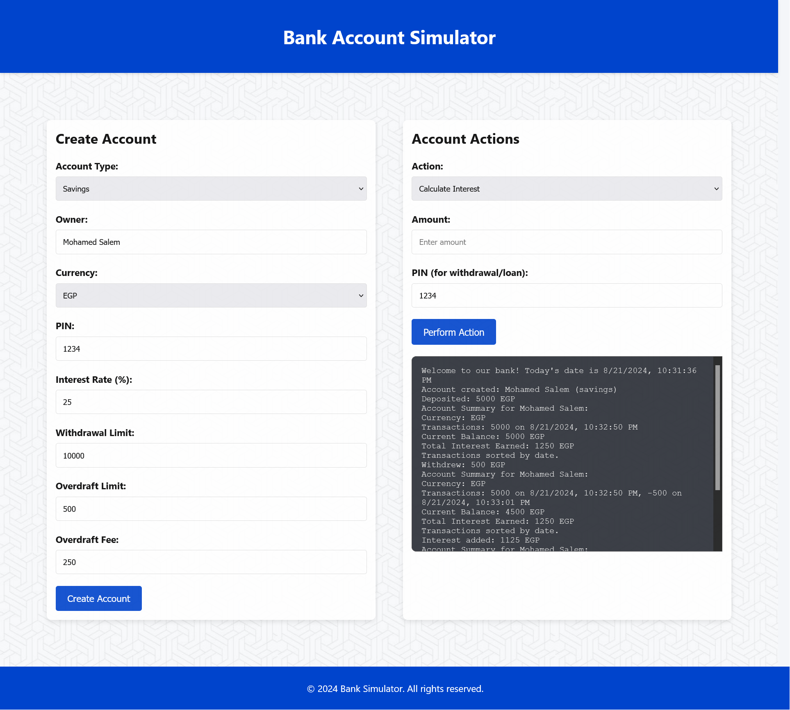

# bank-account-simulator_DEBI-Task

## Overview

The **Bank Account Simulator** is a web application designed to mimic basic banking functionalities. Users can create different types of bank accounts (Savings, Checking, Business) and perform various operations such as deposits, withdrawals, and loan requests. The simulator also supports interest calculation and transaction management.

## Features

- **Create Account**: Users can create Savings, Checking, or Business accounts.
- **Account Actions**: Perform transactions like deposits, withdrawals, and loan requests.
- **Interest Calculation**: Calculate and apply interest on the balance.
- **Transaction Management**: View and sort transactions.
- **Business Account Features**: Special features like large transaction processing and financial reports.

## Technologies Used

- **HTML**: Structure and content of the web pages.
- **CSS**: Styling and layout.
- **JavaScript**: Interactive features and business logic.
- **DOM Manipulation**: For updating the UI based on user actions.

## Usage

1- Create an Account

- Select the type of account (Savings, Checking, Business).
- Fill in the required details and click "Create Account".

2- Perform Actions

- Choose an action (Deposit, Withdraw, Request Loan, etc.).
- Enter the required amount and PIN (for sensitive actions).
- Click "Perform Action" to execute the action.

3- View Console Output

- The console output section displays logs and messages related to actions performed.

## Topics

- **Account Creation**: Forms and validation for creating new accounts.
- **Transactions**: Deposit, withdrawal, and loan functionalities.
- **Interest Calculation**: Method to calculate and apply interest.
- **Business Features**: Processing large transactions and generating financial reports.
- **Error Handling**: Input validation and error messaging.

## Screenshots

Below are some screenshots showing different stages of the website:

### 1. Initial Screen


### 2. Create Account



##Error Handling

- Ensure all required fields are filled out correctly.
- Validations are in place for PINs, interest rates, and other inputs.

## Getting Started

1. **Clone the Repository**

   ```bash
   git clone https://github.com/MoSalem149v2/bank-account-simulator_DEBI-Task.git
